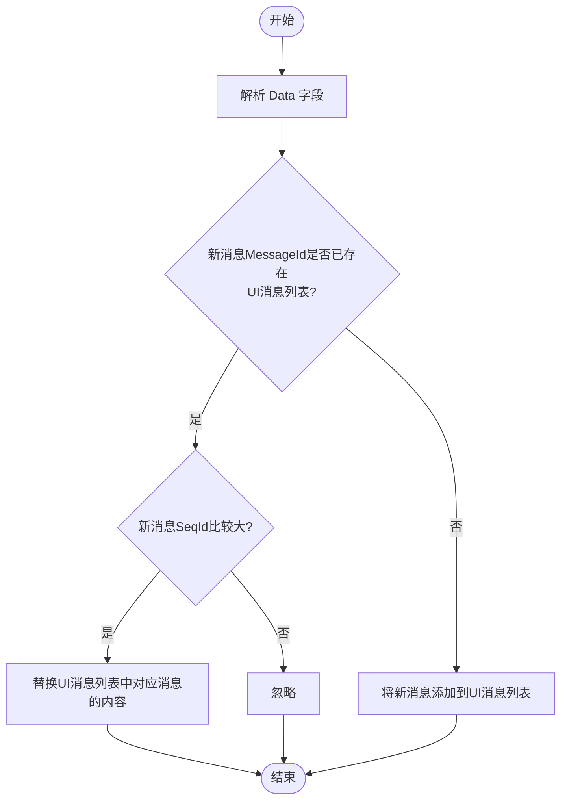
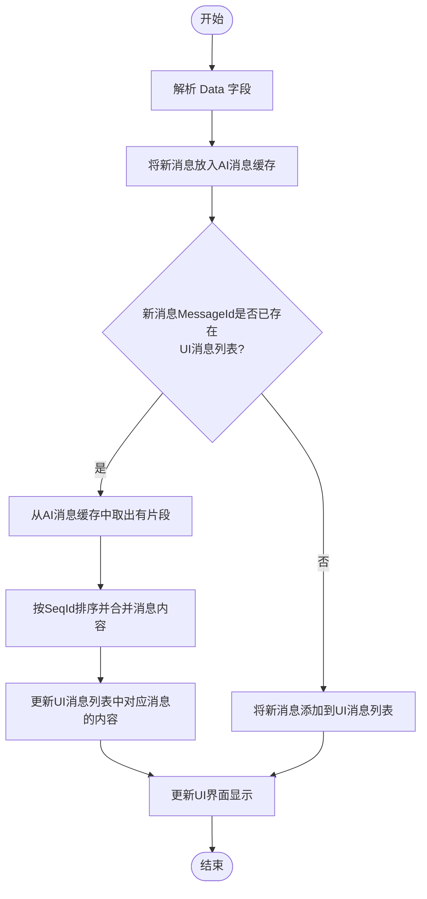

# 展示字幕

---
## 功能介绍

本文介绍如何基于ZEGO的客户端的字幕组件，实现在语音通话、视频通话中，流式（打字机式）展示对应用户/音频流的字幕。

- 字幕组件可以展示的类型：
    - 用户说话字幕：流式展示用户说话文字内容，并支持前向纠错。
    - 翻译字幕：展示翻译文字结果。
- 字幕组件展示的范围：
    - 房间级别所有用户/音频流的字幕
    - 用户/流级别的字幕

<Frame width="auto" height="512" caption="">
  
</Frame>

## 核心说明

字幕组件中，涉及的核心字段说明如下：

| 字段 | 类型 | 描述 |
| --- | --- | --- |
| Timestamp | Number | 时间戳，秒级别 |
| SeqId | Number | 包序列号，可能乱序，请根据序列号对消息进行排序。极端情况下 Id 可能不连续。 |
| Round | Number | 对话轮次，每次用户主动说话轮次增加 |
| Cmd | Number | 201: ASR 语音识别的文本<br/>202: LLM 翻译的文本 |
| Data | Object | 具体内容，各 Cmd 对应不同 Data |

Cmd 不同对应的 Data 也不同，具体如下：

<Tabs>
<Tab title="Cmd 为 201，ASR 识别文本">

| 字段 | 类型 | 描述 |
| --- | --- | --- |
| UserId | string | 说话人的用户 id |
| Text | string | 用户语音识别（ASR）的文本<br/>每次下发的是全量文本，支持文本修正 |
| MessageId | string | 消息 id，每轮 ASR 文本消息 id 唯一 |
| EndFlag | bool | 结束标识，true 表示本轮 ASR 文本已处理完成 |

</Tab>
<Tab title="Cmd 为 202，LLM 翻译文本">

| 字段 | 类型 | 描述 |
| --- | --- | --- |
| UserId | string | 说话人的用户 id |
| Text | string | LLM 翻译文本<br/>每次下发增量文本 |
| MessageId | string | 消息 id，每轮 LLM 翻译文本消息 id 唯一 |
| EndFlag | bool | 结束标识，true 表示本轮 LLM 翻译文本已处理完成 |

</Tab>
</Tabs>

## 字幕组件使用说明

### 前提条件

- 已按照 [快速开始](./../quick-start.mdx) 文档实现基础功能：
    - 集成 ZEGO Express SDK 实现基本的语音通话功能。
    - 基于云端实时语音识别，开启云端实时语音识别，并配置 `SubtitleType` 为 `201` 或 `202`，从而将字幕通过房间信令下发。
<Warning title="注意">
必须使用 [下载 SDK 及 Demo](./../../aiagent-ios/introduction/download.mdx) 页面针对 Cloud ASR 优化的 ZEGO Express SDK 版本，否则无法正常显示字幕。
</Warning>

### 使用字幕组件 <a id="use-subtitle-component" />
<Tabs>
<Tab title="iOS">
您可以直接下载[字幕组件源码](https://github.com/ZEGOCLOUD/cloud_asr_quick_start/tree/master/ios/CloudAsrQuickStart/subtitles)到您的项目中直接使用。

<Accordion title="字幕组件使用示例" defaultOpen="true">
<CodeGroup>
```oc YourView.m {5-6,10-11,20-23,25-26,34-35,56-57,61-62,67-69,73-75,77-79}
#import "YourView.h"

#import <Masonry/Masonry.h>

#import "ZegoCloudAsrSubtitlesTableView.h"
#import "ZegoCloudAsrSubtitlesMessageDispatcher.h"

@interface YourView() <ZegoAIAgentAudioEventHandler, ZegoAIAgentSubtitlesEventHandler>

// 智能体字幕
@property (nonatomic, strong, readwrite) ZegoCloudAsrSubtitlesTableView *subtitlesTableView;

@end

@implementation YourView

- (instancetype)initWithFrame:(CGRect)frame {
    self = [super initWithFrame:frame];
    if (self) {
        // 设置自己的用户 Id
        ZegoCloudAsrServiceAPI.sharedInstance().setUserId(userID)
        // 预设房间 Id（若不设置则会随机房间 Id）
        ZegoCloudAsrServiceAPI.sharedInstance().setRoomId(roomID)

        // 注册事件
        [self registerEventHandler];

        [self setupSubtitles];
    }
    return self;
}

- (void)dealloc {
    // 反注册事件
    [self unregisterEventHandler];
}

- (void)setupSubtitles {
    // 添加聊天视图 - 占据屏幕下半部分
    CGRect chatFrame = CGRectMake(0,
                                 self.bounds.size.height / 2,
                                 self.bounds.size.width,
                                 self.bounds.size.height / 2);
    self.subtitlesTableView = [[ZegoCloudAsrSubtitlesTableView alloc] initWithFrame:chatFrame style:UITableViewStylePlain];

    [self addSubview:self.subtitlesTableView];

    // 使用 Masonry 添加约束
    [self.subtitlesTableView mas_makeConstraints:^(MASConstraintMaker *make) {
        make.left.right.bottom.equalTo(self);
        make.height.equalTo(self.mas_height).multipliedBy(0.5);
    }];
}

- (void)registerEventHandler {
    [[ZegoCloudAsrServiceAPI sharedInstance] registerAudioEventHandler:self];
    [[ZegoCloudAsrSubtitlesMessageDispatcher sharedInstance] registerEventHandler:self];
}

- (void)unregisterEventHandler {
    [[ZegoCloudAsrSubtitlesMessageDispatcher sharedInstance] unregisterEventHandler:self];
    [[ZegoCloudAsrServiceAPI sharedInstance] unregisterAudioEventHandler:self];
}

#pragma mark - ZegoAIAgentAudioEventHandler

- (void)onRecvExperimentalAPI:(NSString *)content{
    [[ZegoCloudAsrSubtitlesMessageDispatcher sharedInstance] handleExpressExperimentalAPIContent:content];
}

#pragma mark - ZegoAIAgentSubtitlesEventHandler

- (void)onRecvAsrChatMsg:(ZegoAIAgentAudioSubtitlesMessage *)message {
    [self.subtitlesTableView handleRecvAsrMessage:message];
}

- (void)onRecvLLMChatMsg:(ZegoAIAgentAudioSubtitlesMessage *)message {
    [self.subtitlesTableView handleRecvLLMMessage:message];
}

@end
```
```oc YourView.h
#import <UIKit/UIKit.h>
#import "ZegoAIAgentSubtitlesEventHandler.h"

NS_ASSUME_NONNULL_BEGIN

@interface YourView : UIView <ZegoAIAgentSubtitlesEventHandler>

@end
```
</CodeGroup>
</Accordion>
</Tab>

<Tab title="Android">
您可以直接下载[字幕处理类源码](https://github.com/ZEGOCLOUD/cloud_asr_quick_start/blob/master/Android/QuickStart/agent_translation_quick_start/src/main/java/im/zego/cloudasr/quickstart/message/AudioChatMessageParser.java)到您的项目中直接使用。
<Accordion title="字幕处理类使用示例" defaultOpen="true">
```java {8-9}
private AudioChatMessageParser audioChatMessageParser = new AudioChatMessageParser();

ZegoExpressEngine.getEngine().setEventHandler(new IZegoEventHandler() {
    @Override
    public void onRecvExperimentalAPI(String content) {
        super.onRecvExperimentalAPI(content);

        // AudioChatTextMessage 会解析 JSON 字符串
        audioChatMessageParser.onRecvExperimentalAPI(content);
    }
});

audioChatMessageParser.setAudioChatMessageListListener(new AudioChatMessageListListener() {
    @Override
    public void onMessageListUpdated(List<AudioChatMessage> messagesList) {
        // 更新 UI 列表
        binding.messageList.onMessageListUpdated(messagesList);
    }
});
```
</Accordion>
</Tab>

<Tab title="Web">
如果您是 Vue 项目，可以直接下载[字幕处理hook](https://github.com/ZEGOCLOUD/cloud_asr_quick_start/blob/master/web/src/hooks/useChat.ts)到您的项目中直接使用。
<Accordion title="Vue 项目字幕处理hook使用示例" defaultOpen="true">
```javascript
// 使用字幕组件示例代码
// 在页面中引入chatHook
import { useChat } from "useChat";
import { onMounted, onBeforeUnmount } from 'vue';

// 调用useChat方法，传入 Express SDK 实例，messages为消息列表，放入你的字幕组件中进行渲染
const { messages, setupEventListeners, clearMessages } = useChat(zg);

onMounted(() => {
  // 页面加载时，注册事件监听
  setupEventListeners()
})

onBeforeUnmount(() => {
 // 页面销毁时，清空消息
 clearMessages()
})

```
</Accordion>
</Tab>
</Tabs>

### （可选）仅展示部分字幕
可以通过筛选UserId等，实现仅展示某些用户或某些流的字幕。
以仅显示其他人翻译后的字幕为例。

<Tabs>
<Tab title="iOS">
```oc ZegoCloudAsrSubtitlesMessageDispatcher.m {7-11,15-19}
- (void)handleMessageContent:(NSString *)msgContent userID:(NSString *)userID userName:(NSString *)userName {
  ......

  if (cmd == ZegoCloudAsrMessageCmdAsrText && messageProtocol.asrTextData) {
    ......

    // 将自定义消息中的 UserId 字段与自己的 UserId 做比较
    if (NO == [userId isEqualToString:[[ZegoCloudAsrServiceAPI sharedInstance] getUserId]]) {
      [ZegoCloudAsrLogUtil write:[NSString stringWithFormat:@"dispatchAsrChatMsg, seqId=%llu, round=%llu, message_id=%@", seqId, round, message_id]];
      [self dispatchAsrChatMsg:cmdMsg];
    }
  } else if (cmd == ZegoCloudAsrMessageCmdLlmText && messageProtocol.llmTextData) {
    ......

    // 将自定义消息中的 UserId 字段与自己的 UserId 做比较
    if (NO == [userId isEqualToString:[[ZegoCloudAsrServiceAPI sharedInstance] getUserId]]) {
        [ZegoCloudAsrLogUtil write:[NSString stringWithFormat:@"dispatchLLMChatMsg, seqId=%llu, round=%llu, message_id=%@", seqId, round, message_id]];
        [self dispatchLLMChatMsg:cmdMsg];
    }
  }
}
```
</Tab>

<Tab title="Android">
在 `AudioChatMessageParser` 类的 `onMessageListUpdated` 方法中，将消息中的 UserId 字段与自己的 UserId 做比较。

```java
audioChatMessageParser.setAudioChatMessageListListener(new AudioChatMessageListListener() {
    @Override
    public void onMessageListUpdated(List<AudioChatMessage> messagesList) {
      String localUserId = xxxx ; //
      for (AudioChatMessage message : messagesList) {
          // 将自定义消息中的 UserId 字段与自己的 UserId 做比较
          if (!message.data.userId.equals(localUserId)) {
              otherUserMessages.add(message);
          }
      }
      // 更新 UI 列表
      binding.messageList.onMessageListUpdated(otherUserMessages);
    }
});
```
</Tab>

<Tab title="Web">
```javascript
// 在示例代码 hooks/useChat.ts 文件里的 handleMessage 方法中添加过滤条件
function handleMessage() {
  // 获取到你存储的本端登录的userId
  const userId = sessionStorage.getItem('userId');
  // 当收到的消息中的 UserId 和 userId 一致，则不处理这条消息
  if (data.UserId === userId) return;
  // ...其余代码保持不变
}
```
</Tab>

</Tabs>

## （不推荐）自定义实现字幕

<Warning title="Warning">建议默认使用字幕组件实现。</Warning>

客户端可通过监听 `onRecvExperimentalAPI` 回调获取 `method` 为 `liveroom.room.on_recive_room_channel_message` 的房间自定义消息。

根据 Cmd 字段判断消息类型，并根据 Data 字段获取消息内容。
<Tabs>
<Tab title="Cmd 为 201，ASR 识别文本">
对应消息处理流程如下图所示：


</Tab>

<Tab title="Cmd 为 202，LLM 翻译文本">
对应消息处理流程如下图所示。其中：
- AI 消息缓存：一个 HashMap，key 为 MessageId，value 为新消息。
- UI 消息列表：包含用户消息和 AI 消息的数组，存储所有在 UI 上展示的消息。


</Tab>
</Tabs>

#### 注意事项

- 消息排序处理：通过房间自定义消息收到的数据可能会乱序，需要根据 SeqId 字段进行排序。
- 流式文本处理：
 - ASR 文本每次下发的是全量文本，同一个 MessageId 的消息需要完全替换之前的内容。
 - LLM 文本每次下发的是增量文本，同一个 MessageId 的消息需要在排序后累加显示。
- 内存管理：请及时清理已完成的消息缓存，特别是当用户进行长时间对话时。